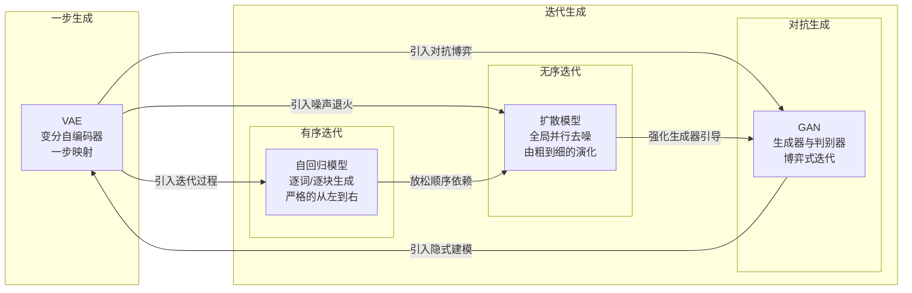

## 第十二章 机器学习：结构发现和统计转换
传统软件是人将提炼好的转换逻辑（算法）写成代码；而人工智能，特别是机器学习，则开启了一种全新的可能，从数据中自动发现转换结构。这是计算机科学中最深刻的范式转变之一，从显式针对问题结构编程到隐式学习问题结构，从理解结构并对结构建模到用大量的数据做结构拟合。

如果说前三次工业革命延伸了人的体力，那么AI正在延伸人的脑力。但它究竟是在思考，还是在以更精致的方式模拟思考？这个问题贯穿了AI发展的全部历史。

人工智能（AI）包含的范围很广。从设计规则，到结构关联，到浅层学习，再到深度学习，是一个从设计到学习的不断深化的过程。

### 12.1 符号AI
符号AI是最早的人工智能尝试，是设计智能的代表，甚至有专门伴生的编程语言LISP。符号AI的核心理念是，智能就是符号操作。1956年达特茅斯会议标志着AI的诞生。主导者坚信，智能可以用符号系统来模拟。赫伯特·西蒙和艾伦·纽厄尔提出了物理符号系统假说，一个物理符号系统具有必要且充分的手段来实现通用智能。

这意味着知识可以编码为符号和规则，推理引擎通过逻辑转换得出新结论。智能 = 符号表征 + 逻辑操作。

#### 12.1.1 专家系统
专家系统是符号AI最成功的商业化形态。其架构清晰而优雅：
- 知识库。存储IF-THEN规则
- 推理机。前向/后向链式推理
- 解释器。向用户解释推理路径

MYCIN（1976）是典型代表，用于诊断血液感染。它的一条规则大致是：如果细菌染色为革兰氏阴性、形态为杆状、患者高热，则推断大肠杆菌感染（置信度0.8）。XCON系统为DEC公司配置VAX计算机，每年节省数千万美元。1997年的深蓝结合符号搜索与评估函数，击败了卡斯帕罗夫。

但是，辉煌之下危机深重：
1. 知识获取瓶颈。专家难以将直觉显式化为规则。知道怎么做，但说不清为什么是常态。
2. 规则边界之外，系统完全失效。没有近似正确或部分匹配的概念。
3. 系统只能使用工程师编码的知识，不能从原始数据中自动提取规则。
4. 规则增多时，推理组合呈指数级增长。

#### 12.1.2 语义网与本体论
语义网的尝试更加宏大，用图结构表达世界知识。本体论定义概念及概念间的关系：
1. 苹果是水果的子类
2. 水果是食物的子类
3. 苹果有的是红色

推理机可以得出结论，苹果是一种食物。

但问题同样麻烦，语义网构建成本极高。这本质上是对人类知识进行全量显式定义，几乎不可能规模化。一个常被引用的讽刺是：“语义网的标志是一个圆圈套圆圈，就像它试图建模的现实一样复杂。”

#### 12.1.3 符号AI的局限
符号AI的本质还是自底向上的构造。无论是定义行动规则，还是定义事物关联，都是尝试从原子层面完全描述结构。这条构造智能的路越走越难，科学家开始考虑我们是不是漏了什么。

符号AI失败的根本原因之一是隐性知识无法被规则编码。波兰尼（Michael Polanyi）说，我们知道的比我们能说出的多。人类专家能做复杂判断，但往往说不清自己怎么做到的。符号AI试图对人类知识做全量显式定义，却恰恰被知识的隐性维度卡住。

观察大脑的物理结构和生物学表现，观察幼儿在复杂环境中如何快速学习生存基础技能，科学家们注意到智能的基础表现结构和行为模式。人类智能显然是习得的，是在与世界的交互中逐渐形成理解。这些推动了AI从构造到习得的转变。

### 12.2 机器学习
机器学习的思路是给定输入和输出，然后尝试学习其规则。一个常见的描述这个行为的词叫做拟合。通过拟合，我们不需要设定任何规则，而是直接从大量输入中得到。

形式化地说，机器学习是在假设空间H中搜索最优函数，使其最小化与输出的差距。

> 然而抽象表述掩盖了一个更本质的问题。我们如何知道假设空间H包含了真正的解？这是所有机器学习的原罪假设。

输入就是数字化的人类知识，常识，记录等，但是怎么确认学到了规则？

#### 12.2.1 监督学习
监督学习依赖人类定义规则来指导机器学习。例如给出一堆不同的猫图，然后明确说，这是猫，这个不是。机器学习就会努力建立这些图像和猫的关联，以期可以在遇到类似的图片的时候，给出正确的答案。   

#### 12.2.2 无监督和半监督学习
然而数据标注的成本非常高。这是无监督学习要解决的问题。没有老师的情况下，智能如何组织知识？聚类、降维、异常检测，这些任务更接近儿童学习的方式。不用提前告知，而是在经验中发现结构。利用输入语料中大量的共现特征，直接输出相关性最强的结果。

半监督学习和强化学习则处于光谱中间，部分监督、部分探索。

#### 12.2.3 强化学习
模型通过损失函数做反馈。强化学习强化了负反馈机制，通过显式的“试错+奖励”机制，让模型可以更快地完成目标对齐，这更接近生物学意义上的学习。

> 有一个经常被忽视的前提是，模型的选择本身就是一种先验。选择神经网络而非决策树，本质上是在说我相信世界可以用可微函数复合来近似。这不是无偏学习，而是用另一种形式的先验替代了符号AI的显式规则。

这些基础的技术很早就有了，也有部分失败或者半失败的结果。直到深度神经网络的兴起，人工智能才真正有用起来。

### 12.3 深度神经网络
神经网络的来源是对人类神经系统的研究和模拟。我们发现，单个神经元可以接受多个输入信息，当信号强度达到一定阈值的时候就会输出信息，这直接启发了感知机的发明。  

#### 12.3.1 从感知机到MLP
感知机（1958）是最简单的神经网络，加权求和用于接收多个信息 、阈值用于控制激活输出（偏置）。但稍后（Minsky和Papert，1969）发现，感知机无法学习异或（XOR）问题。这一发现几乎扼杀了神经网络研究近二十年。

解法出乎意料地简单，把感知机叠起来。多层感知机（MLP）通过引入隐藏层和非线性激活函数，突破了线性边界。通用近似定理（Cybenko，1989）指出，足够宽的MLP可以逼近任意连续函数。这位深度学习提供了理论基础，尽管实践上如何有效地训练仍然是一个问题。

#### 12.3.2 反向传播
反向传播是最重要的工程发现，本质上是微积分链式法则的工程化应用。它的意义远超技术细节，它提供了一种从最终输出到内部参数的统一信用分配机制。无论网络多深，每个参数都知道自己应该往哪个方向调整。

然而，深层网络带来了两个相反的问题。梯度消失（浅层梯度趋近于零，无法学习）和梯度爆炸（梯度指数增长，训练不稳定）。ReLU、批归一化、残差连接等这些技术逐个解决了这些工程挑战，使真正的深度成为可能。

#### 12.3.3 空间结构先验
卷积神经网络（CNN）能在图像识别领域有统治地位，揭示了一个重要原则，内建的结构先验比纯数据驱动更有效。

卷积操作强制三个特性：局部连接、权值共享、平移等变性。这是我们知道自然图像具有局部相关性和平移不变性，然后设计到CNN中，这是一个归纳偏置。因此把这些性质固化在模型结构中。

从AlexNet（2012，ImageNet错误率16.4%）到ResNet（2015，3.6%，超越人类），CNN的演进不仅是工程优化，更是结构先验与数据效率之间的持续平衡。ResNet的残差连接让梯度可以“跳跃”过多个层，本质上是在解决一个优化问题，而非表征问题。

#### 12.3.4 时间结构先验
循环神经网络（RNN）引入了时间维度的权重共享，但同样遭遇梯度消失。LSTM（长短期记忆网络，1997）的解决方案极具洞察力，引入一个独立的信息通道（细胞状态），让梯度可以无损地流动。

LSTM的伟大之处在于，设计者（Hochreiter & Schmidhuber）通过天才的先验洞察，将“记忆与遗忘”这个抽象概念，物化为了可微分的门控结构，从而让梯度消失问题在结构层面被解决，而非指望网络自己去发现。

#### 12.3.5 最小先验
2017年的《Attention Is All You Need》引入Transformer结构，标志着一个根本性的转向，它几乎只保留了最基本的序列操作（注意力 + 位置编码），而把所有序列关系都交给数据去学习。

注意力机制假设序列中任意两个位置之间都可能存在依赖关系。序列中任意两个位置可以直接交互，无需通过中间状态传递。Q（查询）、K（键）、V（值）的点积计算相似度，softmax归一化后加权聚合。

> **为什么需要Q和K**？
> 在精确查找的语义中，如传统的数据库，Q和K是同一个东西；但在语义匹配（近似查找）的系统中，它们的含义有了细微区别。Q代表是是查询端的语义，而K代表是存储的语义。它们可以不同，但是却可以匹配。

这个设计带来了最大变化是所有位置同时计算，GPU硬件可以充分发挥性能优势。Transformer的代价是计算复杂度O(n²)，实践中这个代价被GPU并行性完美消化。

Transformer放弃了时间和空间先验，转而让模型从位置编码中学习顺序关系，这是从“构造”走向“习得”的又一点进步。

Transformer可以粗略分为两大部分，注意力网络（AN）和前馈网络（FFN）。前者学习的是提取和组合事实知识的路由策略，可以理解成一个高动态、基于内容的路由表；后者则是存储诸如事实、模式、语言规则、知识等的地方，像是一个大硬盘。

使用多个AN规划注意力，我们得到多头注意力（MHA）；而使用多个平行的FFN记录事实知识，我们得到混合专家（MoE）。为了支持MoE，我们也需要引入专家路由层（门控网络），用来动态选择不同的FFN。

所有这些，都是用先验的结构设定来表达期望的语义。然后在海量的数据冲刷下不断通过反向传播调整随机预置参数，直到一个期望的输出结果。

#### 12.3.6 LLM的训练
大语言模型的训练一般分为三个阶段，每个阶段的目的各不相同。

##### 12.3.6.1 预训练（Pre-training）
预训练解决知识储备与世界观问题，通过海量的训练材料，赋予模型对现实世界的理解能力、语言语法能力、通用逻辑和背景知识。

这个阶段是参数变化最剧烈、成本最高的阶段。模型从随机初始化的混乱，通过在整个互联网级别的文本上预测下一个词（Next-Token Prediction），把人类几千年积累的知识压缩到了几百亿或几千亿个参数里。

预训练对材料没有特别要求，越多越好，多样性越丰富越好。事实上，目前的前沿大模型倾向于使用所有能拿到数据来做训练。

预训练的结果是一个超级续写补全机。如果你问它“怎么做西红柿炒鸡蛋？”，它可能不会回答你，而是顺着你的话继续写“……是很多人喜欢的家常菜，今天我们就来介绍它的做法：”，因为它根本不知道自己在“对话”。

预训练完成后，模型有了大量的知识，但是还不会运用这些知识。

预训练的成本占了整个模型训练生命周期的大头，大约60~70%。

##### 12.3.6.2 微调（Supervised Fine-Tuning）
微调要解决的问题是，改变模型的交互模式为对话，并注入特定领域的专业能力（如医疗、法律、特定 JSON 格式输出）。

微调需要使用数万到数百万条高质量的“指令-回答”数据（Instruction Data），让模型理解“问答”这种模式。参数在预训练的基础上进行定向微调，让模型明白，当遇到问号或者指令时，我的角色是回答者，区分“你”和“我”。

微调对训练数据的要求非常高，必须是标准的问-答形式，同时满足结构的强制要求。微调极度依赖标准答案（Ground Truth）。对于许多开放性问题，根本没有唯一的标准答案。如果强行用某篇范文做微调，模型只会学会死板地模仿和背诵，容易产生幻觉（Hallucination）或无限迎合用户的问题。

微调完成后，模型已经有了基础的“人格”特征，理解了自己的角色，可以流利地对话。但是因为没有对齐到人类的价值观，就好像一把锋利的没有把手的刀，有用但是很危险。

微调的成本占了整个模型训练生命周期大约10~20%。

##### 12.3.6.3 强化学习（RLHF）
强化学习的目的是解决人类偏好对齐（Alignment）、安全性（Safety）、拒绝有害请求（Refusal）以及复杂多步逻辑推演的问题。

对于强化学习来说，此时不需要人类写出标准答案，而是让模型针对一个问题生成多个回答，再由人类（或另一个评价模型）给出打分。强化学习算法（如 PPO、DPO）会微调模型生成高分回答的概率分布，同时降低生成低分/危险回答的概率。

强化对齐之后，模型不仅仅有完整的人格，而且具有和强化评价标准类似的输出要求。鼓励性的强化学习评价会让模型在探索中组合出人类都没想到的更优输出。

强化学习的成本占了整个模型训练生命周期大约5~10%。

#### 12.3.7 自回归生成
所有这些模型有一个特征，给定部分前置输入（一般叫做提示词，如你的一个问题），模型不断预测匹配前置输入的下一个词，这其实就是输出。这个过程不断重复，直到输出结束标记。

这个过程被称为自回归生成（Autoregressive Generation）。它的本质，是在每一步都基于已经生成的所有内容（包括原始提示词和之前输出的每一个词）作为新的前置输入，来预测下一个词。

为了生成的多样性，故意引入采样策略（如温度系数 `Temperature` 和 Top-p。后者决定选词的范围，前者决定选哪个词，温度越低，高概率词被选中的机会越大）。这是人为制造的随机性，可以避免生成千篇一律的结果，甚至能涌现出令人惊喜的创意。这也就是为什么同一个问题，每次问大模型，得到的答案总会在措辞上略有不同。

自回归是目前使用最广泛的，几乎所有的大语言模型都是基于自回归的。但是这不是唯一的方法，另一类模型叫做生成模型，尤其适合图片生成类任务。

### 12.4 扩散生成模型
#### 12.4.1 什么是生成模型
判别模型指的是给定输入，输出类别的概率。而生成模型学习数据的整体分布，然后从采样输出新的分布。从学习边界到学习分布，这是质的飞跃。

生成模型的核心目标是从简单的噪声分布（如高斯噪声）中，逐步生成复杂的数据分布（如图片）。它们的区别主要在于实现这种转化的具体路径和策略。

这些策略，恰好构成了一条从直接“一步到位”到逐步“迭代求精”的连续谱系。

#### 12.4.2 生成模型的谱系图

这张图的两端是两种极致的策略，而其他所有模型都可以看作是这两种极致的折中或混合。
-   **一步到位派**
    VAE (变分自编码器)是“压缩-重建”的极致。通过一个编码器一步将图像“压缩”成一个低维的隐变量，再通过一个解码器一步将其“解压”回图像。整个过程像一次性的“复印”。但这一步极难学好，因此生成结果常有模糊的问题，因为它只能捕捉数据的平均特征。
-   **博弈演化派**
    GAN (生成对抗网络)是“对抗博弈”的极致。它不直接学习数据分布，而是让一个“伪造者”（生成器）和一个“鉴别者”（判别器）相互博弈，在动态平衡中生成高质量的、清晰的图像。但其训练极不稳定，常出现“模式崩溃”，即生成器只会制造少数几种“骗过”判别器的样本。

图中从左到右的路径代表了逐步增加迭代与约束的过程，从而更好地理解其他模型所处的中间位置：
1. VAE → 自回归模型 (AR)。
   为了对抗VAE的模糊，自回归模型引入了严格的时间顺序。它将生成过程分解为无数个微小的、依赖于历史的条件VAE步骤。每一步都基于前面已经生成的全部信息，来预测下一个token。这种“一步错，步步错”的约束换来了极高的逻辑连贯性，尤其适合文本
2. VAE → 扩散模型 (Diffusion)。
   为了更平滑地演化，扩散模型提出了一条优雅的退火路径。它不像VAE那样一步压缩到位，而是用上千步将一个清晰的图像逐步加噪，直到变成纯高斯噪声。然后它再学习这个过程的逆过程。它生成的过程，是从混沌中缓慢浮现结构的自组织演化
3. 自回归 + 扩散 → 混合模型 (如GRN)。
   自回归擅长全局规划但路径固定，扩散生成灵活但缺乏全局约束。混合模型试图融合两者，用自回归部分负责生成核心的蓝图，解决全局结构问题；再用扩散或流匹配部分负责将蓝图渲染成高保真的细节像素
4. 扩散 → GAN。
   为了提升扩散模型的生成效率（即用更少的去噪步数），研究者引入了对抗训练来优化模型，极大地提升了采样速度。在这个意义下，它可以被理解为“在扩散框架中嵌入了GAN的博弈目标”

文本生成的严格序列性，注定了自回归是绝对主流；图像生成对全局与局部平衡的需求，是扩散和混合模型的主场。

#### 12.4.3 大语言模型与涌现能力
大语言模型（LLM）展示了规模带来质变的惊人现象。当参数量跨越某个阈值（约50-1000亿），能力突然跃升，这被称为涌现。
- 从示例中识别模式，无需梯度更新
- 展示中间推理步骤，解决多步问题
- 理解自然语言任务描述，跨任务泛化
- 从未专门训练的任务中出现

规模法则（OpenAI，2020）量化了这一现象。测试损失随参数量和训练数据量的幂律下降。这意味着更大的模型加上更多的数据，就会持续变好，尚未看到饱和的迹象。

LLM的成功使得普通人也可以体验高级的人工智能技术。很多人宣称奇点已来,更多人开始担忧AI的副作用，甚至呼吁控制AI的使用，这些人中不乏相关的研究人员或者商业公司。这引出了一个基本的问题，什么是智能？为什么要恐慌？

### 12.5 智能的本质
想给智能下一个定义，即便不是不可能，也是非常难的。图灵（1950）年跳过了直接定义，而是给出一个行为主义式的、可操作的定义，叫做图灵测试。

#### 12.5.1 图灵测试
图灵认为，不用纠结于什么是智能，只要能回答什么算是智能就行。如果一台计算机在行为上与人类无法区分（通过对话测试），那么出于实用主义的目的，我们没有理由否认它具有智能。尽管数学上不是完善的，但是不可分辨性意味着等价性。

这个看起来很容易通过。一个早期的名叫做Eliza的对话机器人，尽管其基本原理就是精巧的复读加上简单的“关键词-模板”映射，  却在1960年代让很多人误以为自己被理解了，甚至对ELIZA产生情感依恋。 这种现象后来被称为 “ELIZA效应”。这些实验表明，毋宁说机器智能的充分性，更不如说人类判断的局限性，人类太容易被欺骗了。

现在的LLM模型有人格设定，可以有记忆，能理解复杂的信息，甚至越来越了解你，体现出不寻常的情感特征。很多人认为图灵测试已经完全通过，意义不大了，但是更多人不同意。通过测试等于“理解”吗？

时空交汇，这两位思想的巨人相逢在了2026年。他们试用了最新的大语言模型后，发生了如下对话。

> **图灵**：你看，我已经预料到会这样。现在他们可以说“它能生成语法正确的句子，但它不理解”，就像当年他们说“机器能下棋但它不会思考”。他们退缩到了不可观察的内心里。
>
> **维特根斯坦**：我们不被这种谈论方式所诱惑。“理解”不是一个秘密的状态。在一个语言游戏中，如果一个实体能回应、能询问、能做出恰当的判断，那么它已经在这个游戏中占有一席之地了。
>
> **图灵**：正是如此。我通过“模仿游戏”说清楚了这一点。如果你无法区分它，那你就不能否认它。他们现在想用“理解”这个幽灵来逃避这个逻辑结论。
>
> **维特根斯坦**：是的。但这意味着我们必须放弃一种直觉：即理解是一种“发生在内部”的东西。它不是。它是一种能力，一种在公共行为中展现出来的能力。而我们面前的这个系统恰恰展示了这种能力。
> 
> **图灵**（微笑）：那么，你同意它有智能？
> 
> **维特根斯坦**：我同意问题问错了。不要再寻找灵魂，看看它做了什么。语言游戏还在继续，而我们人类自己就是其中的一部分。当然，也包括它。

进入了LLM时代，关于智能的理解更加深化，更多人从哲学层面给出了新的回答。

#### 12.5.2 压缩即智能
这一观点认为，智能的核心是发现数据中的规律，并用更简洁的形式表达。文件压缩算法（如gzip）寻找统计冗余；LLM寻找更深层的语义规律。从这一视角看，预测下一个词本质上是在压缩文本，模型越能准确预测，说明它越理解背后的规律。

大模型的压缩能力惊人。GPT-4可以用不到1比特/字符的交叉熵损失表示原始文本，这意味着它学会了远超表层统计的深层结构。更激进的观点认为，无监督学习本质上是压缩，而压缩就是理解。

然而反驳者认为，gzip也能压缩文本，但没人认为它理解。压缩捕捉的是统计规律，而非因果结构和语义意图。

#### 12.5.3 涌现即智能
涌现主义者认为，当系统复杂度超过某个阈值，质的飞跃会发生。单个神经元没有智能，但数十亿神经元的交互产生了思想；单个词没有意义，但词语的组合产生了理解。

大模型的涌现能力正是这一哲学的证据。思维链、上下文学习、代码生成等，这些能力没有明确设计，而是从足够大的模型和足够多的数据中自发出现。这一立场更接近复杂系统理论和神经科学的观点。

支持的论据有，规模法则证明了能力的平滑增长；思维链能力仅在模型足够大时出现；模型展示了未训练领域的泛化能力。

反驳的理由也不容忽视。涌现或许是统计量的外推而非质的飞跃。模型可能只是学会了更复杂的模式匹配，而非真正的推理。从鹦鹉学舌到真正理解，中间可能横亘着不可逾越的鸿沟。

#### 12.5.4 随机鹦鹉
这是最谨慎（也是最批评）的立场。大语言模型本质上是随机鹦鹉，通过大量统计学习，学会根据上下文拼接训练数据中见过的片段，但不理解这些片段的语义和真值。

真正的人类理解包含意图性（知道词语指向现实）、因果模型（理解为什么A导致B）、反事实推理（想象如果不同会怎样）。大模型展示的所有智能都可以解释为训练数据的巧妙重组。

模型会生成荒谬的错误（幻觉）；对对抗性输入极其脆弱；缺乏稳定的世界模型；不理解物理规律（如物体恒存性）：这些可以作为证据。

但是人类也会犯错、产生幻觉、被误导。区别是量而非质？批评者认为这个滑坡是危险的。

#### 12.5.5 信仰、怀疑与未来
无可否认机器学习取得了的巨大成就：
- 无需人工设计特征的自动端到端学习
- 更多数据+更大参数→更好性能，尚未饱和
- 测试误差远小于训练误差（传统学习理论无法完全解释）

但是挑战和局限同样存在：
- 需要海量标注数据（少样本学习仍是开放问题）
- 训练分布≠测试分布时性能崩溃
- 学习相关而非因果，无法回答“如果...会怎样”
- 学习新任务会覆盖旧知识
- 黑箱决策，难以审计和信任

其中没有一个问题是容易解决的。

AI是统计学习、优化算法与大规模计算的工程产物，代表了计算的第三次浪潮：
- 规则（传统编程）。人显式编写每一步
- 状态（软件工程）。人设计数据结构和管理复杂性
- 从数据中自动发现转换结构。人设计学习算法，结构从数据中涌现

这第三次浪潮的深远意义尚未完全显现。它不仅改变了我们如何构建软件，更可能改变我们如何理解智能本身。如果理解可以从简单的预测目标中涌现，那我们对意识、意图、自由意志的理解可能需要根本性的修订。

最明智的态度或许是既承认大模型在统计模式匹配上的惊人成就，也保持对“什么是真正的理解”这一根本问题的开放追问。智能的本质可能比我们想象的更复杂，也可能比我们担心的更简单，而AI正是帮助我们探索这个问题的最强大探针。

### 12.7 本章小结
从符号AI的构造智能，到机器学习的从数据中习得映射，再到深度学习的层次化表示自动发现，AI的演进贯穿了一条清晰的主线，从人类设计结构，到从数据中发现结构。

CNN内建了空间局部性的先验，LSTM内建了记忆门控的先验，Transformer放弃了顺序先验而依赖位置编码，每一次架构创新都是对先验结构的重新思考和矫正。

大语言模型的涌现能力引发了关于智能本质的深刻辩论：压缩即智能？涌现即智能？还是随机鹦鹉？答案可能介于三者之间。统计学习是基础，规模带来质变，但真正的理解仍需因果模型和意图性。但是显然这个还没有答案，图灵给出了关于智能的操作性定义，人们依旧在追问智能的本质。

AI的第三次浪潮的真正意义在于，它不仅改变了技术，更提供了一个前所未有的视角，让我们重新审视人类智能本身。正如物理学家用加速器探索物质结构，AI研究者用神经网络探索认知结构，而这个探索才刚刚开始。
